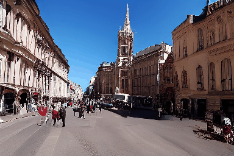

# GRID: Video Generation Model Comparison

This repository compares GRID (our model) with other state-of-the-art video generation models including AnimateDiffV3, VideoCrafter2, and CogVideo5B.

## Portrait Video Comparison

**Prompt:** "A woman with glasses wearing a white t-shirt sits at a wooden desk. An open notebook and calculator lie before her. She examines the document then picks up a pen. She wears bracelets on her wrist. Home study setting with natural light."

<table>
  <tr>
    <td align="center"><b>GRID (Ours)</b></td>
    <td align="center"><b>AnimateDiffV3</b></td>
  </tr>
  <tr>
    <td></td>
    <td></td>
  </tr>
  <tr>
    <td align="center"><b>VideoCrafter2</b></td>
    <td align="center"><b>CogVideo5B</b></td>
  </tr>
  <tr>
    <td></td>
    <td></td>
  </tr>
</table>

## Landscape Video Comparison

**Prompt:** "Elegant European city street with curved row of sandstone historical buildings, arched entrances, uniform windows, neoclassical architectural style, parked cars, few pedestrians, camera slowly moving forward."

<table>
  <tr>
    <td align="center"><b>GRID (Ours)</b></td>
    <td align="center"><b>AnimateDiffV3</b></td>
  </tr>
  <tr>
    <td></td>
    <td></td>
  </tr>
  <tr>
    <td align="center"><b>VideoCrafter2</b></td>
    <td align="center"><b>CogVideo5B</b></td>
  </tr>
  <tr>
    <td></td>
    <td></td>
  </tr>
</table>

## Long Video Comparison (128 frames)

<table>
  <tr>
    <td align="center"><b>GRID (Ours)</b></td>
    <td align="center"><b>CogVideo5B</b></td>
  </tr>
  <tr>
    <td></td>
    <td></td>
  </tr>
</table>

## About the Models

- **GRID**: Our proposed model for high-quality video generation
- **AnimateDiffV3**: Text-to-video diffusion model
- **VideoCrafter2**: Advanced video generation framework
- **CogVideo5B**: Large-scale video generation model

---

### Video Playback

Click on the thumbnails to download and view the video files. GIF animations display automatically.

To view all videos in full quality:
- [GRID Portrait Video](./static/1.mp4)
- [VideoCrafter2 Portrait Video](./static/vcver-0001.mp4)
- [CogVideo5B Portrait Video](./static/cogvideo.mp4)
- [GRID Landscape Video](./static/2.mp4)
- [VideoCrafter2 Landscape Video](./static/vc-0002.mp4)
- [CogVideo5B Landscape Video](./static/cog2.mp4)
- [GRID Long Video](./static/128.mp4)
- [CogVideo5B Long Video](./static/cog2long128.mp4)
